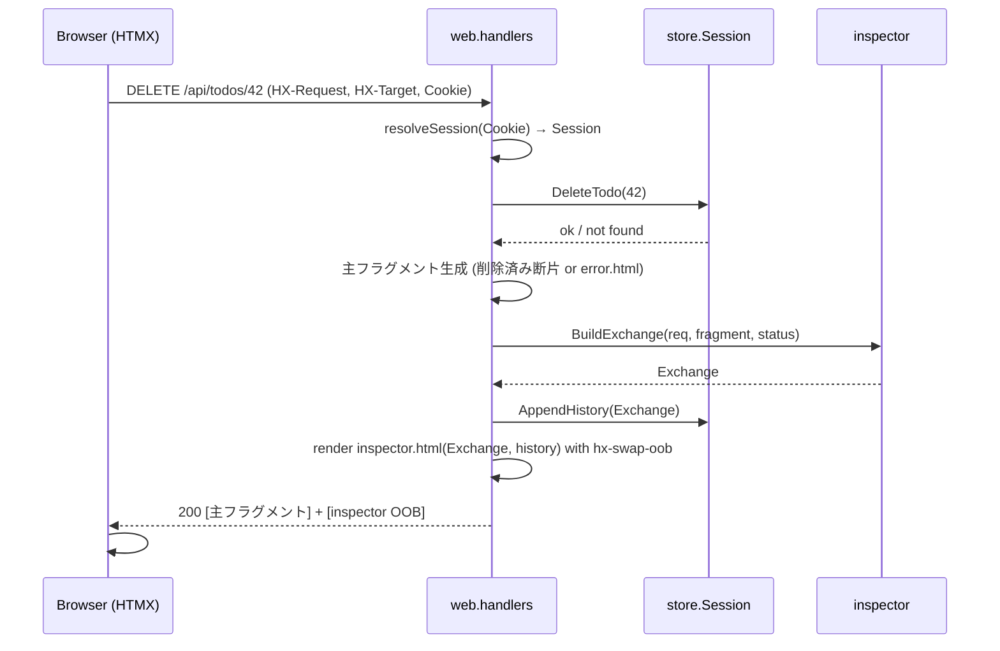

# http-anatomy Design

## Overview
Go 標準ライブラリ（`net/http` + `html/template`）で構築する単一バイナリの Web アプリ。状態は session 別 in-memory ストア（`sync.RWMutex` で保護）に保持する。各 CRUD/タブ操作のハンドラは「主フラグメント」を文字列として先に生成・捕捉し、その内容を埋め込んだ「インスペクター断片（`hx-swap-oob`）」を連結した 1 レスポンスを返す。これにより 1 リクエストで左ペインの対象要素と右ペインのインスペクターが同時に書き換わる HATEOAS を成立させる。フロントは HTMX（CDN）のみ、独自 JS の状態管理は持たない。

## Architecture

### Components
- **main**: `PORT`（既定 8080）読取、ルータ構築、localhost / LAN URL 表示、`http.ListenAndServe`。
- **model**: ドメイン型 `Todo` / `User` / `Exchange`（純粋なデータ）。
- **store**: `Store` が `map[sessionID]*Session` を保持。`Session` は Todos / Users / 履歴 / 採番カウンタを持つ。全操作は mutex 保護。CRUD メソッドは純粋なデータ操作のみで HTTP を知らない。
- **inspector**: `*http.Request` と生成した主フラグメント・status から `Exchange` を組み立てる（ヘッダ選別・整形）。
- **web**:
  - `session.go`: Cookie `ha_session` の取得/発行、`Store` から該当 `Session` を解決するミドルウェア的ヘルパ。
  - `router.go`: `http.ServeMux`（Go 1.22+ のメソッド付きパターン）でルート登録。
  - `handlers.go`: 各 CRUD / タブ / トップページのハンドラ。主フラグメント生成 → Exchange 記録 → OOB 連結レスポンス。
  - `render.go`: `html/template`（`go:embed` で埋め込み）の薄いラッパ。名前付きテンプレートを文字列へレンダリングするヘルパ `renderToString`。
- **templates**（`go:embed`）: `page.html`（2ペイン外枠 + HTMX 読込）, `todo-item.html`, `todos.html`, `user-item.html`, `users.html`, `inspector.html`, `error.html`。

### レイヤ依存方向
`web` → `store` / `inspector` / `model`、`inspector` → `model`、`store` → `model`。`model` は何にも依存しない。HTTP を知るのは `web` のみ。

### Request/Response フロー（DELETE Todo の例）



## Data Models

```go
// model/todo.go
type Todo struct {
    ID    int
    Title string
    Done  bool
}

// model/user.go
type User struct {
    ID    int
    Name  string
    Email string
}

// model/exchange.go — インスペクター 1 行ぶんの交信記録
type Header struct{ Name, Value string }

type Exchange struct {
    Method      string   // "DELETE"
    Path        string   // "/api/todos/42"
    Proto       string   // "HTTP/1.1"
    ReqHeaders  []Header // Host, HX-Request, HX-Target, HX-Trigger, Content-Type
    Status      int      // 200
    StatusText  string   // "OK"
    RespCType   string   // "text/html; charset=utf-8"
    Body        string   // 主フラグメント（テンプレ側でエスケープ表示）
}
```

```go
// store/store.go
type Session struct {
    Todos     []model.Todo
    Users     []model.User
    History   []model.Exchange // 新しい順、最大 10 件
    todoSeq   int
    userSeq   int
}

type Store struct {
    mu       sync.RWMutex
    sessions map[string]*Session
}
```

ストア API（HTTP 非依存・テスト容易）:
`GetOrCreate(id) *Session` / `(*Session) AddTodo / ToggleTodo / UpdateTodo / DeleteTodo` / 同 User 群 / `AppendHistory(Exchange)`（先頭追加・10件 trim）。`Session` 操作も `Store.mu` 下で行うため、ハンドラは `Store` のメソッド経由で触る（`Session` を外に貸し出さず race を避ける）。

## API Design

| Method | Endpoint | 主フラグメント | OOB |
|--------|----------|----------------|-----|
| GET | `/` | `page.html`（2ペイン全体, 初期は Todos） | — |
| GET | `/fragments/todos` | `todos.html` | inspector |
| GET | `/fragments/users` | `users.html` | inspector |
| POST | `/api/todos` | 追加された `todo-item.html` | inspector |
| PATCH | `/api/todos/{id}` | 更新後 `todo-item.html` | inspector |
| DELETE | `/api/todos/{id}` | 削除済み断片（空） | inspector |
| POST | `/api/users` | 追加された `user-item.html` | inspector |
| PATCH | `/api/users/{id}` | 更新後 `user-item.html` | inspector |
| DELETE | `/api/users/{id}` | 削除済み断片（空） | inspector |

HTMX 属性の例:
```html
<button hx-delete="/api/todos/42" hx-target="#todo-42" hx-swap="outerHTML">削除</button>
<form hx-post="/api/todos" hx-target="#todo-list" hx-swap="beforeend">…</form>
```
新規追加は `hx-target="#todo-list" hx-swap="beforeend"` で末尾に主フラグメントを足し、インスペクターは常に OOB で全置換する。

### OOB 連結の実装方針
1. ハンドラがまず主フラグメントを `renderToString` で生成（`primary string`）。
2. `inspector.BuildExchange(r, primary, status)` で Exchange 化、`AppendHistory`。
3. `inspector.html` を `renderToString`（ルート要素に `id="http-inspector" hx-swap-oob="true"`）。Exchange.Body には手順1の `primary` のみを渡す（自己再帰回避）。
4. レスポンス本文 = `primary + inspectorHTML` を `w.Write`。

## Error Handling
- 不正 id（非整数）/ 不在リソース: status 404、主フラグメント = `error.html`（メッセージ）。インスペクターは通常どおり OOB 更新し 404 交信を可視化（FR-005）。
- フォーム必須値欠落（空タイトル等）: status 422、`error.html` を返し、インスペクターに反映。
- いずれも `http.Error` の素テキストではなく HTML 断片で返す（HTMX swap 先に収まるため）。

## Security Considerations
- 認証なし（公開教材）。セッション Cookie は識別のみ・機微情報を持たない。
- すべてのユーザー入力は `html/template` の自動エスケープ下で出力。インスペクター本文（Body）は「コードとして見せる」ため `<pre>` 内にエスケープ表示し、`template.HTML` を使わない。
- セッション ID は `crypto/rand` ベースの UUID。Cookie は `HttpOnly`、`SameSite=Lax`。
- リクエストボディ・タイトル長に上限（例: 200 文字）を設け、メモリ濫用を抑制。

## Testing Strategy
- **Unit (store)**: 採番の単調増加、Toggle/Update/Delete の整合、セッション分離（別 id が干渉しない）、History の 10 件 trim と新しい順。
- **Unit (inspector)**: 選定ヘッダのみ抽出されること、status→StatusText 整形、Body にインスペクター自身が混入しないこと。
- **Integration (web, httptest)**: 各エンドポイントが「主フラグメント + `hx-swap-oob` を含むインスペクター」を返すこと、初回 GET `/` が `Set-Cookie` すること、不在 id で 404 断片を返すこと、Cookie 引継ぎで状態が保持されること。
- **手動**: Chrome / Safari / Firefox で 2 タブを開き、別セッションとして独立に CRUD できることを確認。

## Deployment
- multi-stage `Dockerfile`: `golang:1.x` でビルド → `gcr.io/distroless/static`（または scratch）へ単一バイナリを配置。`PORT` 環境変数を尊重。
- `fly.toml`: 単一インスタンス（`min_machines_running = 1`、`auto_stop_machines` は揮発状態に注意して設定）。内部ポートは `PORT`。
- README に「状態は in-memory・プロセス再起動で消える」旨を明記。
